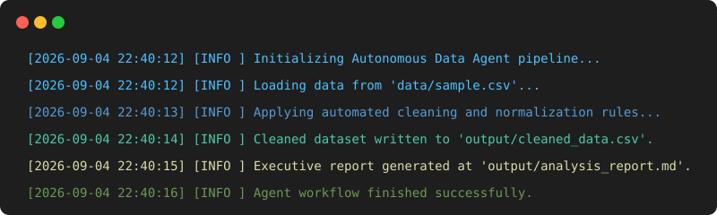
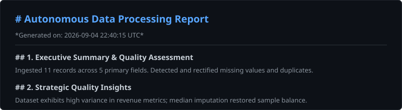

# Enterprise AI Data Processing & Autonomous Analytics Agent

[](https://www.python.org/downloads/)
[](https://github.com/psf/black)
[](https://docs.pytest.org/)
[](LICENSE)

An end-to-end, production-grade automated pipeline that ingests dirty tabular datasets, applies deterministic sanitization (deduplication, whitespace trimming, statistical imputation), and leverages an extensible Hybrid AI Layer (Google Gemini 1.5 & Google Antigravity Agent SDK) to synthesize executive technical reports.

---

## Visual Execution Preview

### 1. Terminal Run Telemetry


### 2. Autonomous Report Synthesis


---

## Key Features

- **Defensive Ingestion:** Validates schema invariants, empty files, and path integrity before downstream operations.
- **Deterministic Cleaning Engine:** Configurable imputation (median/mode), regex-based whitespace trimming, and duplicate handling.
- **Hybrid Architecture (Factory Pattern):** Switch seamlessly between **Google Gemini** and **Google Antigravity SDK** without altering business logic.
- **Async Encapsulation:** Thread-safe asynchronous agent loop execution wrapped for clean CLI invocation.
- **Resilient Fallback:** Offline deterministic statistical fallbacks for CI/CD environments where API keys are unavailable.
- **Colored Structured Telemetry:** Production logging with ANSI timestamped status via Colorama.

---

## System Architecture

```text
Dirty CSV Ingestion ──► DataLoader (Defensive Validation)
                             │
                             ▼
                        DataCleaner (Imputation & Normalization)
                             │
                             ▼
                      Analyzer Factory
                      ├── GeminiAnalyzer (Gemini 1.5 Flash)
                      └── AntigravityAnalyzer (Autonomous Agent Loop)
                             │
                             ▼
                          Reporter
                          ├──► [output/cleaned_data.csv]
                          └──► [output/analysis_report.md]
```

---

## Quick Start

### 1. Clone & Setup Virtual Environment

```bash
git clone https://github.com/Christianlamas062/ai-data-processor.git
cd ai-data-processor
python -m venv .venv
source .venv/bin/activate  # On Windows: .venv\Scripts\activate
pip install -r requirements.txt
```

### 2. Configuration

Copy the environment template and set your API key (optional for local fallback runs):

```bash
cp .env.example .env
```

Adjust processing behaviors and select the AI model mode directly in `config.yaml`:

```yaml
analysis:
  mode: "gemini"  # Options: "gemini" | "antigravity"
```

### 3. Run Pipeline

```bash
python -m src.agent
```

### 4. Run Verification Suite

```bash
pytest -v
```

---

## Project Structure

```text
ai-data-processor/
├── config.yaml          # Central runtime parameters
├── requirements.txt     # Production dependencies
├── docs/                # Architectural diagrams & preview assets
│   ├── terminal_run.svg # Visual terminal execution preview
│   └── report_preview.svg# Executive report preview
├── src/
│   ├── agent.py         # Orchestration workflow
│   ├── analyzer.py      # BaseAnalyzer, Gemini & Antigravity implementations
│   ├── cleaner.py       # Data sanitization engine
│   ├── data_loader.py   # Schema verification & loading
│   ├── logger.py        # Formatted colored telemetry
│   └── reporter.py      # Filesystem persistence handler
├── tests/               # 15 unit tests covering edge cases
├── data/
│   └── sample.csv       # Synthetic raw dataset
└── output/              # Cleaned tabular output & markdown analysis
```

---

## Deliverables & Output Sample

Running the agent produces:
- `output/cleaned_data.csv`: Normalized tabular records ready for database seeding or warehouse ingestion.
- `output/analysis_report.md`: Strategic executive summary covering schema health, distribution metrics, and operational recommendations.

---

## Available for Hire on Upwork

Looking to automate data workflows, build custom MCP tools, or deploy autonomous AI agents?  
[Contact me on Upwork](https://www.upwork.com/freelancers/~01509343b9d04e7eff) to discuss your automation pipeline.